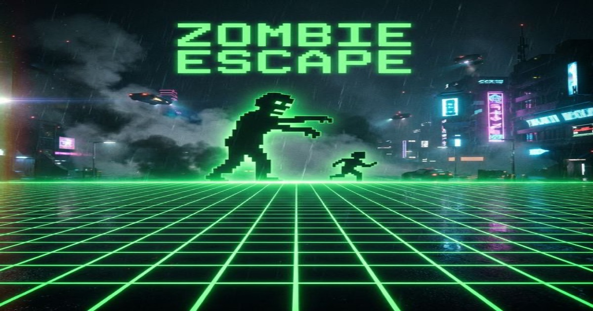

<p align="center">
  
</p>

<h1 align="center">Zombie Escape Online</h1>

<p align="center">
  A turn-based puzzle/survival browser game inspired by <em>Daleks</em> and <em>Rodent's Revenge</em>.
  <br>
  Outsmart zombies on a grid. Reach the exit. Don't get caught.
</p>

<p align="center">
  <a href="https://zombie-escape-online.com">Play Now</a> &middot;
  <a href="#contributing">Contribute</a> &middot;
  <a href="https://github.com/user/zombie-escape-online/issues">Report Bug</a>
</p>

<p align="center">
  
  
  
</p>

---

## About

You move **1 tile per turn**. Zombies move **2 tiles** toward you using greedy Manhattan distance pathfinding. Navigate walls, trap zombies, and reach the exit across 5 difficulty tiers: **Beginner, Easy, Medium, Hard, Expert**.

### Features

- **Turn-based grid strategy** — pure logic, no reflexes needed
- **15+ visual themes** — zombies, pirates, space, dungeons, kaiju, jungle, and more
- **Procedural retro synth music** — Web Audio API generated soundtrack
- **Mobile friendly** — touch controls, swipe gestures, responsive layout
- **Cloud saves** — Google authentication with Firebase
- **Endless mode** — random levels per difficulty tier
- **PWA support** — installable as a home screen app
- **Accessible** — screen reader announcements, keyboard navigation

## Getting Started

### Prerequisites

- [Docker](https://www.docker.com/) (for Firebase Emulators)

### Run Locally

```bash
git clone https://github.com/user/zombie-escape-online.git
cd zombie-escape-online/frontend
make run
```

This starts Firebase Emulators via Docker:
- **Game**: http://localhost:5000
- **Emulator UI**: http://localhost:4000

No Firebase account needed for local development — emulators handle everything.

### Without Docker

If you prefer not to use Docker, you can serve the `frontend/` directory with any static file server (e.g. `npx serve .`), but Firebase Auth and Firestore features won't work without the emulators.

## Project Structure

```
frontend/
├── game.js              # Main controller — orchestrates all modules
├── engine.js            # Core game engine (shared with generator)
├── skins.js             # 15+ visual themes
├── audio.js             # Procedural music + sound effects
├── modules/
│   ├── levels.js        # Loads levels from Firestore by difficulty tier
│   ├── game-state.js    # Engine wrapper (tier mode + sequential mode)
│   ├── firebase.js      # Auth, Firestore, emulator detection
│   ├── renderer.js      # CSS Grid-based board rendering
│   ├── input.js         # Keyboard, D-pad, swipe input
│   ├── ui.js            # Menus, overlays, difficulty picker
│   ├── dom.js           # Centralized DOM references
│   ├── analytics.js     # Google Analytics event tracking
│   ├── accessibility.js # Screen reader ARIA announcements
│   └── privacy.js       # Cookie consent
└── utils/
    ├── logger.js        # Production-safe logging (silent in prod)
    ├── env.js           # Environment detection
    └── production-check.js
```

The **generator** (`generator/` in parent directory) creates and validates levels using a BFS solver, then pushes them to Firestore via `push_catalog.py`.

## How It Works

1. **Levels** are stored in Firestore, grouped by difficulty tier (beginner → expert)
2. Player picks a tier → a random level from that tier is loaded
3. Each turn: player moves → win check → zombies move 2 steps → loss check
4. Zombies use greedy pathfinding: try largest axis delta first, then fallback axis
5. Zombies block each other — trapping them behind walls is the core strategy
6. Non-square grids auto-transpose to match screen orientation

## Contributing

We welcome contributions! See [CONTRIBUTING.md](CONTRIBUTING.md) for:

- Setting up your local environment
- Code style guidelines
- How to submit pull requests
- How to create and contribute new levels

## Security

Found a vulnerability? Please see [SECURITY.md](SECURITY.md) for responsible disclosure guidelines. Do **not** open a public issue for security vulnerabilities.

## License

This project is licensed under the [MIT License](LICENSE).
